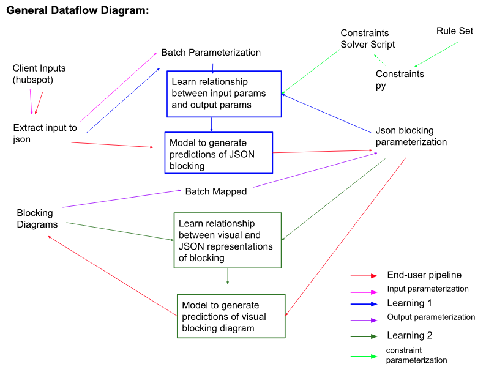

# Automated Blocking Diagram Generation
 Hilario Gonzalez, Josh Bardwick\
 Design Ergonomics

## Overview

The goal of this project is to automate the generation of blocking diagrams for dental office layouts, using customer-submitted project parameters and the Design Ergonomics design ethos and rule set. This system transforms raw client input into a fully parameterized representation of a dental office layout, and ultimately into a generated blocking diagram. This README contains the parameter schemas that descirbe how we encoded information from the rule set, client parameters, and blocking diagram.

Current Obj: Parameterizing and clarifying rule set

***

## Problem Statement

Our Task is to streamline dental office layout creation by reducing repetitive manual processes and enforcing a consistent design philosophy. The system we developed is outlined here:
* Converts client-supplied room specifications, quantities, and facility dimensions into actionable structured input.
* Encodes the Design Ergonomics design rule set as a parameterized, machine-readable constraint system.
* Parameterizes all spatial, dimensional, and categorical information used in blocking diagrams.
* Generates a textual, structured intermediate representation of the blocking diagram.
* Produces a final blocking diagram from that parameterized representation.

***
## System Architecture
### This project is composed the the following major components:
***

### 1. Input Parsing and Normalization
Transforms client-provided information (desired rooms, room types, counts, spatial constraints, floor dimensions, etc.) into normalized, parameterized data structures.

### 2. Rule Set Formalization
Converts the Design Ergonomics design ethos and rule constraints into a machine-readable form. Rules include size, orientation, access, visibility, and scalability constraints.

### 3. Blocking Diagram Blueprint Parameterization
Defines how blueprint-level concepts (room boundaries, canonical dimensions, relative placements, shared walls, etc.) are encoded.

### 4. Parameterized Blocking Diagram Generation
Produces an intermediate textual representation of the blocking diagram based on:
* Parsed client parameters
* Rule set constraints
* Diagram schema
* Optimized layout based on design ethos, either encoded itself or learned by training on encoded database

### 5. Output Diagram Rendering
Generates a final blocking diagram from the parameterized intermediate representation. (method TBD)

***

### The Major Component Flow and Interactions Illustrated:

This illustrates the dependencies between project components and shows how all parameterization and batch automation (input, constraints and output) must be completed in order to use them for the 2 learning components.

***

## Repository Structure
```
ergoAgent/  
-README.md  
-.gitignore  
-blocking/ 
-params/  
    -mapping.json  
    -parameters.json  
    -parser.py  
    -processParams.py  
    -tests.py  
    -README.md  
-ruleSet/
    -ruleset.json  
    -README.md  
```
***

## Usage

***

## Notes

- Repo init 11/17/25
